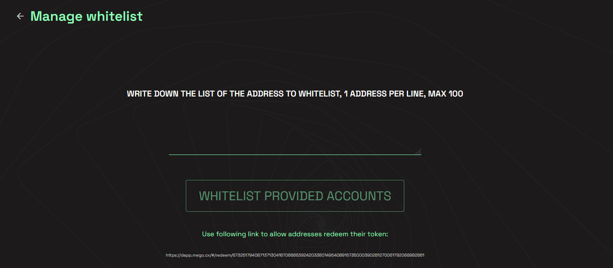

# Manage whitelist

To manage your whitelist, simply click on the _whitelist_ icon and you will be redirected to this page:

Here you can write a list of addresses in the text input, writing one address at line, without any kind of comma or other separator. This is an example:

After you created your list simply write on "WHITELIST PROVIDED ACCOUNTS", you will need to confirm the transaction with your Metamask account.

Each whitelisted address can access provided link to claim the token, in the example the link is: \
[https://dapp.mego.cx/#/redeem/41283608080091118423385257998006738702710803816668584942604332109593202121202](https://dapp.mego.cx/#/redeem/41283608080091118423385257998006738702710803816668584942604332109593202121202)
